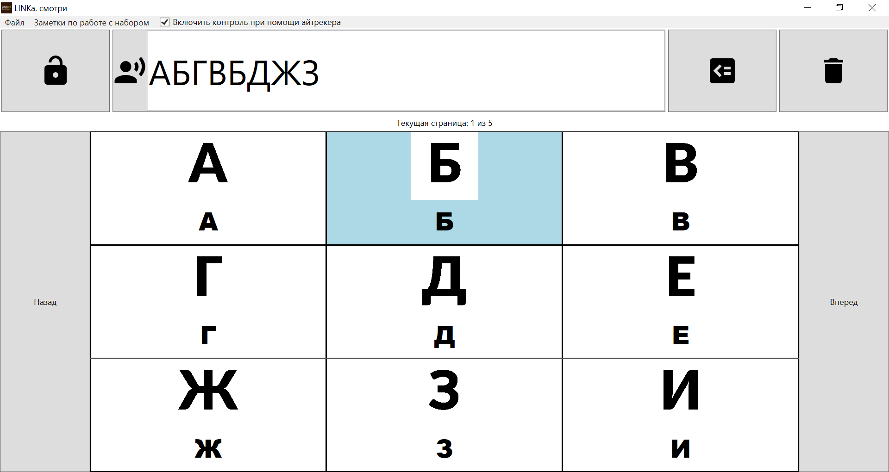

# Клавиатуры для LINKa




Здесь расположены __ruby-скрипты__, которые генерируют _.linka_-карточки для программы __"LINKa. смотри"__ <https://linka.su/looks/>. Исходники оригинальной программы —  <https://github.com/linkasu/LINKa.look-windows>.

Карточки представляют из себя экранные клавиатуры, похожие на "LINKA.Бумажная клавиатура" (программа есть только для Android/iOS). Описание — <https://linka.su/linka-paperboard/>, исходный код — <https://github.com/linkasu/paperboard-android>. Более подробное описание от автора есть — <https://habr.com/ru/company/linka/blog/421133/>.

Выходной файл ­— `kbd_3x2.linka`, в зависимости от числа строк и столбцов.

## Требования

- проверена работа скрипта только на OS Linux, наверняка всё будет работать и на macOS
- чтобы запустить на OS Windows, нужен WSL (работать будет точно)
- ruby 3.0+ (на более ранних версиях не проверял)
- RHVoice для озвучивания при нажатии
- ImageMagick для обработки изображений
- внутри скрипта указано использование шрифта Lato, так что стоит установить пакет с ним либо указать путь к другому .ttf-шрифту

## Использование

Чтобы получить файл экранной клавиатуры размером 3 столбца на 2 строчки, достаточно просто запустить скрипт командой `./generate.rb 3 2` или `ruby ./generate.rb 3 2`. 

Первое число в параметрах скрипта — это число столбцов в целевом файле, второе — число строк. В итоге получим файл `kbd_3x2.linka`

```
~/repos/linka_gen_kbd # ./generate.rb 3 2
Re-creating out_dir...
Generating config.json...
Generating template: /tmp/linka_template20220816-28646-b0vz1n.png
convert -size 1280x1280 xc:white /tmp/linka_template20220816-28646-b0vz1n.png
Generating space symbol...
Generating letters PNGs...
convert -font /usr/share/fonts/truetype/lato/Lato-Black.ttf -fill black -gravity center -pointsize 1024 -draw 'text 0,0 "А"' /tmp/linka_template20220816-28646-b0vz1n.png out_dir/А.png
echo А | RHVoice-test -R 44100 -p anna -o out_dir/А.wav
convert -font /usr/share/fonts/truetype/lato/Lato-Black.ttf -fill black -gravity center -pointsize 1024 -draw 'text 0,0 "Б"' /tmp/linka_template20220816-28646-b0vz1n.png out_dir/Б.png
echo Б | RHVoice-test -R 44100 -p anna -o out_dir/Б.wav
convert -font /usr/share/fonts/truetype/lato/Lato-Black.ttf -fill black -gravity center -pointsize 1024 -draw 'text 0,0 "В"' /tmp/linka_template20220816-28646-b0vz1n.png out_dir/В.png
echo В | RHVoice-test -R 44100 -p anna -o out_dir/В.wav
convert -font /usr/share/fonts/truetype/lato/Lato-Black.ttf -fill black -gravity center -pointsize 1024 -draw 'text 0,0 "Г"' /tmp/linka_template20220816-28646-b0vz1n.png out_dir/Г.png
echo Г | RHVoice-test -R 44100 -p anna -o out_dir/Г.wav
convert -font /usr/share/fonts/truetype/lato/Lato-Black.ttf -fill black -gravity center -pointsize 1024 -draw 'text 0,0 "Д"' /tmp/linka_template20220816-28646-b0vz1n.png out_dir/Д.png
echo Д | RHVoice-test -R 44100 -p anna -o out_dir/Д.wav
convert -font /usr/share/fonts/truetype/lato/Lato-Black.ttf -fill black -gravity center -pointsize 1024 -draw 'text 0,0 "Е"' /tmp/linka_template20220816-28646-b0vz1n.png out_dir/Е.png
echo Е | RHVoice-test -R 44100 -p anna -o out_dir/Е.wav
convert -font /usr/share/fonts/truetype/lato/Lato-Black.ttf -fill black -gravity center -pointsize 1024 -draw 'text 0,0 "Ж"' /tmp/linka_template20220816-28646-b0vz1n.png out_dir/Ж.png
echo Ж | RHVoice-test -R 44100 -p anna -o out_dir/Ж.wav
convert -font /usr/share/fonts/truetype/lato/Lato-Black.ttf -fill black -gravity center -pointsize 1024 -draw 'text 0,0 "З"' /tmp/linka_template20220816-28646-b0vz1n.png out_dir/З.png
echo З | RHVoice-test -R 44100 -p anna -o out_dir/З.wav
convert -font /usr/share/fonts/truetype/lato/Lato-Black.ttf -fill black -gravity center -pointsize 1024 -draw 'text 0,0 "И"' /tmp/linka_template20220816-28646-b0vz1n.png out_dir/И.png
echo И | RHVoice-test -R 44100 -p anna -o out_dir/И.wav
convert -font /usr/share/fonts/truetype/lato/Lato-Black.ttf -fill black -gravity center -pointsize 1024 -draw 'text 0,0 "Й"' /tmp/linka_template20220816-28646-b0vz1n.png out_dir/Й.png
echo Й | RHVoice-test -R 44100 -p anna -o out_dir/Й.wav
convert -font /usr/share/fonts/truetype/lato/Lato-Black.ttf -fill black -gravity center -pointsize 1024 -draw 'text 0,0 "К"' /tmp/linka_template20220816-28646-b0vz1n.png out_dir/К.png
echo К | RHVoice-test -R 44100 -p anna -o out_dir/К.wav
convert -font /usr/share/fonts/truetype/lato/Lato-Black.ttf -fill black -gravity center -pointsize 1024 -draw 'text 0,0 "Л"' /tmp/linka_template20220816-28646-b0vz1n.png out_dir/Л.png
echo Л | RHVoice-test -R 44100 -p anna -o out_dir/Л.wav
convert -font /usr/share/fonts/truetype/lato/Lato-Black.ttf -fill black -gravity center -pointsize 1024 -draw 'text 0,0 "М"' /tmp/linka_template20220816-28646-b0vz1n.png out_dir/М.png
echo М | RHVoice-test -R 44100 -p anna -o out_dir/М.wav
convert -font /usr/share/fonts/truetype/lato/Lato-Black.ttf -fill black -gravity center -pointsize 1024 -draw 'text 0,0 "Н"' /tmp/linka_template20220816-28646-b0vz1n.png out_dir/Н.png
echo Н | RHVoice-test -R 44100 -p anna -o out_dir/Н.wav
convert -font /usr/share/fonts/truetype/lato/Lato-Black.ttf -fill black -gravity center -pointsize 1024 -draw 'text 0,0 "О"' /tmp/linka_template20220816-28646-b0vz1n.png out_dir/О.png
echo О | RHVoice-test -R 44100 -p anna -o out_dir/О.wav
convert -font /usr/share/fonts/truetype/lato/Lato-Black.ttf -fill black -gravity center -pointsize 1024 -draw 'text 0,0 "П"' /tmp/linka_template20220816-28646-b0vz1n.png out_dir/П.png
echo П | RHVoice-test -R 44100 -p anna -o out_dir/П.wav
convert -font /usr/share/fonts/truetype/lato/Lato-Black.ttf -fill black -gravity center -pointsize 1024 -draw 'text 0,0 "Р"' /tmp/linka_template20220816-28646-b0vz1n.png out_dir/Р.png
echo Р | RHVoice-test -R 44100 -p anna -o out_dir/Р.wav
convert -font /usr/share/fonts/truetype/lato/Lato-Black.ttf -fill black -gravity center -pointsize 1024 -draw 'text 0,0 "С"' /tmp/linka_template20220816-28646-b0vz1n.png out_dir/С.png
echo С | RHVoice-test -R 44100 -p anna -o out_dir/С.wav
convert -font /usr/share/fonts/truetype/lato/Lato-Black.ttf -fill black -gravity center -pointsize 1024 -draw 'text 0,0 "Т"' /tmp/linka_template20220816-28646-b0vz1n.png out_dir/Т.png
echo Т | RHVoice-test -R 44100 -p anna -o out_dir/Т.wav
convert -font /usr/share/fonts/truetype/lato/Lato-Black.ttf -fill black -gravity center -pointsize 1024 -draw 'text 0,0 "У"' /tmp/linka_template20220816-28646-b0vz1n.png out_dir/У.png
echo У | RHVoice-test -R 44100 -p anna -o out_dir/У.wav
convert -font /usr/share/fonts/truetype/lato/Lato-Black.ttf -fill black -gravity center -pointsize 1024 -draw 'text 0,0 "Ф"' /tmp/linka_template20220816-28646-b0vz1n.png out_dir/Ф.png
echo Ф | RHVoice-test -R 44100 -p anna -o out_dir/Ф.wav
convert -font /usr/share/fonts/truetype/lato/Lato-Black.ttf -fill black -gravity center -pointsize 1024 -draw 'text 0,0 "Х"' /tmp/linka_template20220816-28646-b0vz1n.png out_dir/Х.png
echo Х | RHVoice-test -R 44100 -p anna -o out_dir/Х.wav
convert -font /usr/share/fonts/truetype/lato/Lato-Black.ttf -fill black -gravity center -pointsize 1024 -draw 'text 0,0 "Ц"' /tmp/linka_template20220816-28646-b0vz1n.png out_dir/Ц.png
echo Ц | RHVoice-test -R 44100 -p anna -o out_dir/Ц.wav
convert -font /usr/share/fonts/truetype/lato/Lato-Black.ttf -fill black -gravity center -pointsize 1024 -draw 'text 0,0 "Ч"' /tmp/linka_template20220816-28646-b0vz1n.png out_dir/Ч.png
echo Ч | RHVoice-test -R 44100 -p anna -o out_dir/Ч.wav
convert -font /usr/share/fonts/truetype/lato/Lato-Black.ttf -fill black -gravity center -pointsize 1024 -draw 'text 0,0 "Ш"' /tmp/linka_template20220816-28646-b0vz1n.png out_dir/Ш.png
echo Ш | RHVoice-test -R 44100 -p anna -o out_dir/Ш.wav
convert -font /usr/share/fonts/truetype/lato/Lato-Black.ttf -fill black -gravity center -pointsize 1024 -draw 'text 0,0 "Щ"' /tmp/linka_template20220816-28646-b0vz1n.png out_dir/Щ.png
echo Щ | RHVoice-test -R 44100 -p anna -o out_dir/Щ.wav
convert -font /usr/share/fonts/truetype/lato/Lato-Black.ttf -fill black -gravity center -pointsize 1024 -draw 'text 0,0 "Ъ"' /tmp/linka_template20220816-28646-b0vz1n.png out_dir/Ъ.png
echo Ъ | RHVoice-test -R 44100 -p anna -o out_dir/Ъ.wav
convert -font /usr/share/fonts/truetype/lato/Lato-Black.ttf -fill black -gravity center -pointsize 1024 -draw 'text 0,0 "Ы"' /tmp/linka_template20220816-28646-b0vz1n.png out_dir/Ы.png
echo Ы | RHVoice-test -R 44100 -p anna -o out_dir/Ы.wav
convert -font /usr/share/fonts/truetype/lato/Lato-Black.ttf -fill black -gravity center -pointsize 1024 -draw 'text 0,0 "Ь"' /tmp/linka_template20220816-28646-b0vz1n.png out_dir/Ь.png
echo Ь | RHVoice-test -R 44100 -p anna -o out_dir/Ь.wav
convert -font /usr/share/fonts/truetype/lato/Lato-Black.ttf -fill black -gravity center -pointsize 1024 -draw 'text 0,0 "Э"' /tmp/linka_template20220816-28646-b0vz1n.png out_dir/Э.png
echo Э | RHVoice-test -R 44100 -p anna -o out_dir/Э.wav
convert -font /usr/share/fonts/truetype/lato/Lato-Black.ttf -fill black -gravity center -pointsize 1024 -draw 'text 0,0 "Ю"' /tmp/linka_template20220816-28646-b0vz1n.png out_dir/Ю.png
echo Ю | RHVoice-test -R 44100 -p anna -o out_dir/Ю.wav
convert -font /usr/share/fonts/truetype/lato/Lato-Black.ttf -fill black -gravity center -pointsize 1024 -draw 'text 0,0 "Я"' /tmp/linka_template20220816-28646-b0vz1n.png out_dir/Я.png
echo Я | RHVoice-test -R 44100 -p anna -o out_dir/Я.wav
convert -font /usr/share/fonts/truetype/lato/Lato-Black.ttf -fill black -gravity center -pointsize 1024 -draw 'text 0,0 "0"' /tmp/linka_template20220816-28646-b0vz1n.png out_dir/0.png
echo 0 | RHVoice-test -R 44100 -p anna -o out_dir/0.wav
convert -font /usr/share/fonts/truetype/lato/Lato-Black.ttf -fill black -gravity center -pointsize 1024 -draw 'text 0,0 "1"' /tmp/linka_template20220816-28646-b0vz1n.png out_dir/1.png
echo 1 | RHVoice-test -R 44100 -p anna -o out_dir/1.wav
convert -font /usr/share/fonts/truetype/lato/Lato-Black.ttf -fill black -gravity center -pointsize 1024 -draw 'text 0,0 "2"' /tmp/linka_template20220816-28646-b0vz1n.png out_dir/2.png
echo 2 | RHVoice-test -R 44100 -p anna -o out_dir/2.wav
convert -font /usr/share/fonts/truetype/lato/Lato-Black.ttf -fill black -gravity center -pointsize 1024 -draw 'text 0,0 "3"' /tmp/linka_template20220816-28646-b0vz1n.png out_dir/3.png
echo 3 | RHVoice-test -R 44100 -p anna -o out_dir/3.wav
convert -font /usr/share/fonts/truetype/lato/Lato-Black.ttf -fill black -gravity center -pointsize 1024 -draw 'text 0,0 "4"' /tmp/linka_template20220816-28646-b0vz1n.png out_dir/4.png
echo 4 | RHVoice-test -R 44100 -p anna -o out_dir/4.wav
convert -font /usr/share/fonts/truetype/lato/Lato-Black.ttf -fill black -gravity center -pointsize 1024 -draw 'text 0,0 "5"' /tmp/linka_template20220816-28646-b0vz1n.png out_dir/5.png
echo 5 | RHVoice-test -R 44100 -p anna -o out_dir/5.wav
convert -font /usr/share/fonts/truetype/lato/Lato-Black.ttf -fill black -gravity center -pointsize 1024 -draw 'text 0,0 "6"' /tmp/linka_template20220816-28646-b0vz1n.png out_dir/6.png
echo 6 | RHVoice-test -R 44100 -p anna -o out_dir/6.wav
convert -font /usr/share/fonts/truetype/lato/Lato-Black.ttf -fill black -gravity center -pointsize 1024 -draw 'text 0,0 "7"' /tmp/linka_template20220816-28646-b0vz1n.png out_dir/7.png
echo 7 | RHVoice-test -R 44100 -p anna -o out_dir/7.wav
convert -font /usr/share/fonts/truetype/lato/Lato-Black.ttf -fill black -gravity center -pointsize 1024 -draw 'text 0,0 "8"' /tmp/linka_template20220816-28646-b0vz1n.png out_dir/8.png
echo 8 | RHVoice-test -R 44100 -p anna -o out_dir/8.wav
convert -font /usr/share/fonts/truetype/lato/Lato-Black.ttf -fill black -gravity center -pointsize 1024 -draw 'text 0,0 "9"' /tmp/linka_template20220816-28646-b0vz1n.png out_dir/9.png
echo 9 | RHVoice-test -R 44100 -p anna -o out_dir/9.wav
Creating output file kbd_3x2.linka...
  adding: 0.png (deflated 18%)
  adding: 0.wav (deflated 18%)
  adding: 1.png (deflated 47%)
  adding: 1.wav (deflated 15%)
  adding: 2.png (deflated 20%)
  adding: 2.wav (deflated 17%)
  adding: 3.png (deflated 16%)
  adding: 3.wav (deflated 21%)
  adding: 4.png (deflated 33%)
  adding: 4.wav (deflated 19%)
  adding: 5.png (deflated 19%)
  adding: 5.wav (deflated 24%)
  adding: 6.png (deflated 16%)
  adding: 6.wav (deflated 22%)
  adding: 7.png (deflated 25%)
  adding: 7.wav (deflated 18%)
  adding: 8.png (deflated 15%)
  adding: 8.wav (deflated 15%)
  adding: 9.png (deflated 17%)
  adding: 9.wav (deflated 18%)
  adding: config.json (deflated 84%)
  adding: space.png (deflated 81%)
  adding: space.wav (deflated 16%)
  adding: А.png (deflated 17%)
  adding: А.wav (deflated 23%)
  adding: Б.png (deflated 35%)
  adding: Б.wav (deflated 19%)
  adding: В.png (deflated 22%)
  adding: В.wav (deflated 21%)
  adding: Г.png (deflated 91%)
  adding: Г.wav (deflated 19%)
  adding: Д.png (deflated 33%)
  adding: Д.wav (deflated 19%)
  adding: Е.png (deflated 89%)
  adding: Е.wav (deflated 19%)
  adding: Ж.png (deflated 15%)
  adding: Ж.wav (deflated 20%)
  adding: З.png (deflated 18%)
  adding: З.wav (deflated 19%)
  adding: И.png (deflated 25%)
  adding: И.wav (deflated 25%)
  adding: Й.png (deflated 19%)
  adding: Й.wav (deflated 19%)
  adding: К.png (deflated 23%)
  adding: К.wav (deflated 23%)
  adding: Л.png (deflated 29%)
  adding: Л.wav (deflated 21%)
  adding: М.png (deflated 21%)
  adding: М.wav (deflated 22%)
  adding: Н.png (deflated 90%)
  adding: Н.wav (deflated 21%)
  adding: О.png (deflated 15%)
  adding: О.wav (deflated 25%)
  adding: П.png (deflated 91%)
  adding: П.wav (deflated 25%)
  adding: Р.png (deflated 32%)
  adding: Р.wav (deflated 22%)
  adding: С.png (deflated 17%)
  adding: С.wav (deflated 22%)
  adding: Т.png (deflated 91%)
  adding: Т.wav (deflated 24%)
  adding: У.png (deflated 16%)
  adding: У.wav (deflated 26%)
  adding: Ф.png (deflated 20%)
  adding: Ф.wav (deflated 27%)
  adding: Х.png (deflated 14%)
  adding: Х.wav (deflated 23%)
  adding: Ц.png (deflated 81%)
  adding: Ц.wav (deflated 21%)
  adding: Ч.png (deflated 48%)
  adding: Ч.wav (deflated 21%)
  adding: Ш.png (deflated 91%)
  adding: Ш.wav (deflated 19%)
  adding: Щ.png (deflated 80%)
  adding: Щ.wav (deflated 18%)
  adding: Ъ.png (deflated 35%)
  adding: Ъ.wav (deflated 17%)
  adding: Ы.png (deflated 35%)
  adding: Ы.wav (deflated 24%)
  adding: Ь.png (deflated 35%)
  adding: Ь.wav (deflated 17%)
  adding: Э.png (deflated 18%)
  adding: Э.wav (deflated 24%)
  adding: Ю.png (deflated 14%)
  adding: Ю.wav (deflated 20%)
  adding: Я.png (deflated 23%)
  adding: Я.wav (deflated 18%)
File: kbd_3x2.linka is ready.
~/repos/linka_gen_kbd #
```

## Лицензия

Автор скрипта — Паша Любецкий <mailto:pasha.liubetski@yandex.com>, лицензия — _Creative Commons Attribution 4.0 International (CC-BY 4.0)_.
