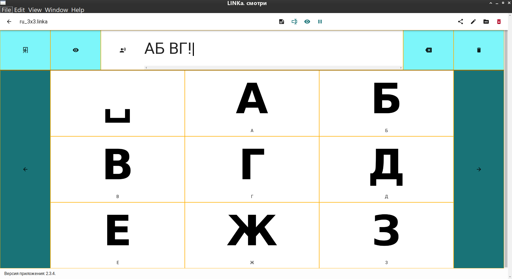
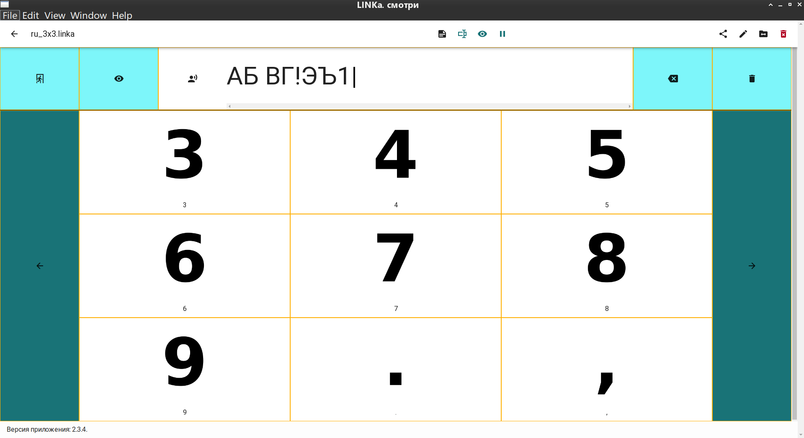

# Клавиатуры для LINKa




Здесь расположены __ruby-скрипты__, которые генерируют _.linka_-карточки для программы __"LINKa. смотри"__ <https://linka.su/looks/>. Исходники оригинальной программы —  <https://github.com/linkasu/linka.looks-electron/>.

Карточки представляют из себя экранные клавиатуры, похожие на **"LINKA.Бумажная клавиатура"** (программа есть только для Android/iOS). Описание — <https://linka.su/linka-paperboard/>, исходный код — <https://github.com/linkasu/paperboard-android> и <https://github.com/linkasu/paperboard-ios>. Более подробное описание от автора здесь — <https://habr.com/ru/company/linka/blog/421133/>.

Выходные файлы — `en_3x2.linka` (английский язык) и `ru_3x2.linka` (русский язык), вместо "3x2" могут стоять другие числа, в зависимости от числа строк и столбцов.

## Системные требования

- проверена работа скрипта только на OS Linux, наверняка всё будет работать и на macOS
- чтобы запустить на OS Windows, нужен WSL
- ruby 3.1+ (на более ранних версиях не проверял)
- ImageMagick для обработки изображений
- внутри скрипта указано использование шрифта DejaVu, так что стоит установить пакет с ним либо указать путь к другому .ttf-шрифту (файл `gen_assets.rb`, параметр `@@font_file`).

## Использование

Сначала нужно запустить `./gen_assets.rb`, затем — `./gen_zips.rb`.

1. Скрипт `./gen_assets.rb` создаёт .png-файлы с изображениями букв в папке `assets`.
2. Скрипт `./gen_zips.rb` создаёт файлы с карточками: `en_1x1.linka`, `en_2x1.linka`, `en_2x2.linka`, `en_3x3.linka`, `en_4x4.linka`, `ru_1x1.linka`, `ru_2x1.linka`, `ru_2x2.linka`, `ru_3x3.linka`, `ru_4x4.linka`.

```bash
~/linka_gen_kbd # ./gen_assets.rb                
convert -size 1280x1280 xc:white /tmp/linka_template20231201-35576-3961n0.png
convert -font /usr/share/fonts/truetype/dejavu/DejaVuSans-Bold.ttf -fill black -gravity center -pointsize 1024 -draw 'text 0,0 "0"' /tmp/linka_template20231201-35576-3961n0.png assets/0.png
convert -font /usr/share/fonts/truetype/dejavu/DejaVuSans-Bold.ttf -fill black -gravity center -pointsize 1024 -draw 'text 0,0 "1"' /tmp/linka_template20231201-35576-3961n0.png assets/1.png
convert -font /usr/share/fonts/truetype/dejavu/DejaVuSans-Bold.ttf -fill black -gravity center -pointsize 1024 -draw 'text 0,0 "2"' /tmp/linka_template20231201-35576-3961n0.png assets/2.png
convert -font /usr/share/fonts/truetype/dejavu/DejaVuSans-Bold.ttf -fill black -gravity center -pointsize 1024 -draw 'text 0,0 "3"' /tmp/linka_template20231201-35576-3961n0.png assets/3.png
convert -font /usr/share/fonts/truetype/dejavu/DejaVuSans-Bold.ttf -fill black -gravity center -pointsize 1024 -draw 'text 0,0 "4"' /tmp/linka_template20231201-35576-3961n0.png assets/4.png
convert -font /usr/share/fonts/truetype/dejavu/DejaVuSans-Bold.ttf -fill black -gravity center -pointsize 1024 -draw 'text 0,0 "5"' /tmp/linka_template20231201-35576-3961n0.png assets/5.png
convert -font /usr/share/fonts/truetype/dejavu/DejaVuSans-Bold.ttf -fill black -gravity center -pointsize 1024 -draw 'text 0,0 "6"' /tmp/linka_template20231201-35576-3961n0.png assets/6.png
convert -font /usr/share/fonts/truetype/dejavu/DejaVuSans-Bold.ttf -fill black -gravity center -pointsize 1024 -draw 'text 0,0 "7"' /tmp/linka_template20231201-35576-3961n0.png assets/7.png
convert -font /usr/share/fonts/truetype/dejavu/DejaVuSans-Bold.ttf -fill black -gravity center -pointsize 1024 -draw 'text 0,0 "8"' /tmp/linka_template20231201-35576-3961n0.png assets/8.png
convert -font /usr/share/fonts/truetype/dejavu/DejaVuSans-Bold.ttf -fill black -gravity center -pointsize 1024 -draw 'text 0,0 "9"' /tmp/linka_template20231201-35576-3961n0.png assets/9.png
convert -font /usr/share/fonts/truetype/dejavu/DejaVuSans-Bold.ttf -fill black -gravity center -pointsize 1024 -draw 'text 0,0 "A"' /tmp/linka_template20231201-35576-3961n0.png assets/A.png
convert -font /usr/share/fonts/truetype/dejavu/DejaVuSans-Bold.ttf -fill black -gravity center -pointsize 1024 -draw 'text 0,0 "B"' /tmp/linka_template20231201-35576-3961n0.png assets/B.png
convert -font /usr/share/fonts/truetype/dejavu/DejaVuSans-Bold.ttf -fill black -gravity center -pointsize 1024 -draw 'text 0,0 "C"' /tmp/linka_template20231201-35576-3961n0.png assets/C.png
convert -font /usr/share/fonts/truetype/dejavu/DejaVuSans-Bold.ttf -fill black -gravity center -pointsize 1024 -draw 'text 0,0 "D"' /tmp/linka_template20231201-35576-3961n0.png assets/D.png
convert -font /usr/share/fonts/truetype/dejavu/DejaVuSans-Bold.ttf -fill black -gravity center -pointsize 1024 -draw 'text 0,0 "E"' /tmp/linka_template20231201-35576-3961n0.png assets/E.png
convert -font /usr/share/fonts/truetype/dejavu/DejaVuSans-Bold.ttf -fill black -gravity center -pointsize 1024 -draw 'text 0,0 "F"' /tmp/linka_template20231201-35576-3961n0.png assets/F.png
convert -font /usr/share/fonts/truetype/dejavu/DejaVuSans-Bold.ttf -fill black -gravity center -pointsize 1024 -draw 'text 0,0 "G"' /tmp/linka_template20231201-35576-3961n0.png assets/G.png
convert -font /usr/share/fonts/truetype/dejavu/DejaVuSans-Bold.ttf -fill black -gravity center -pointsize 1024 -draw 'text 0,0 "H"' /tmp/linka_template20231201-35576-3961n0.png assets/H.png
convert -font /usr/share/fonts/truetype/dejavu/DejaVuSans-Bold.ttf -fill black -gravity center -pointsize 1024 -draw 'text 0,0 "I"' /tmp/linka_template20231201-35576-3961n0.png assets/I.png
convert -font /usr/share/fonts/truetype/dejavu/DejaVuSans-Bold.ttf -fill black -gravity center -pointsize 1024 -draw 'text 0,0 "J"' /tmp/linka_template20231201-35576-3961n0.png assets/J.png
convert -font /usr/share/fonts/truetype/dejavu/DejaVuSans-Bold.ttf -fill black -gravity center -pointsize 1024 -draw 'text 0,0 "K"' /tmp/linka_template20231201-35576-3961n0.png assets/K.png
convert -font /usr/share/fonts/truetype/dejavu/DejaVuSans-Bold.ttf -fill black -gravity center -pointsize 1024 -draw 'text 0,0 "L"' /tmp/linka_template20231201-35576-3961n0.png assets/L.png
convert -font /usr/share/fonts/truetype/dejavu/DejaVuSans-Bold.ttf -fill black -gravity center -pointsize 1024 -draw 'text 0,0 "M"' /tmp/linka_template20231201-35576-3961n0.png assets/M.png
convert -font /usr/share/fonts/truetype/dejavu/DejaVuSans-Bold.ttf -fill black -gravity center -pointsize 1024 -draw 'text 0,0 "N"' /tmp/linka_template20231201-35576-3961n0.png assets/N.png
convert -font /usr/share/fonts/truetype/dejavu/DejaVuSans-Bold.ttf -fill black -gravity center -pointsize 1024 -draw 'text 0,0 "O"' /tmp/linka_template20231201-35576-3961n0.png assets/O.png
convert -font /usr/share/fonts/truetype/dejavu/DejaVuSans-Bold.ttf -fill black -gravity center -pointsize 1024 -draw 'text 0,0 "P"' /tmp/linka_template20231201-35576-3961n0.png assets/P.png
convert -font /usr/share/fonts/truetype/dejavu/DejaVuSans-Bold.ttf -fill black -gravity center -pointsize 1024 -draw 'text 0,0 "Q"' /tmp/linka_template20231201-35576-3961n0.png assets/Q.png
convert -font /usr/share/fonts/truetype/dejavu/DejaVuSans-Bold.ttf -fill black -gravity center -pointsize 1024 -draw 'text 0,0 "R"' /tmp/linka_template20231201-35576-3961n0.png assets/R.png
convert -font /usr/share/fonts/truetype/dejavu/DejaVuSans-Bold.ttf -fill black -gravity center -pointsize 1024 -draw 'text 0,0 "S"' /tmp/linka_template20231201-35576-3961n0.png assets/S.png
convert -font /usr/share/fonts/truetype/dejavu/DejaVuSans-Bold.ttf -fill black -gravity center -pointsize 1024 -draw 'text 0,0 "T"' /tmp/linka_template20231201-35576-3961n0.png assets/T.png
convert -font /usr/share/fonts/truetype/dejavu/DejaVuSans-Bold.ttf -fill black -gravity center -pointsize 1024 -draw 'text 0,0 "U"' /tmp/linka_template20231201-35576-3961n0.png assets/U.png
convert -font /usr/share/fonts/truetype/dejavu/DejaVuSans-Bold.ttf -fill black -gravity center -pointsize 1024 -draw 'text 0,0 "V"' /tmp/linka_template20231201-35576-3961n0.png assets/V.png
convert -font /usr/share/fonts/truetype/dejavu/DejaVuSans-Bold.ttf -fill black -gravity center -pointsize 1024 -draw 'text 0,0 "W"' /tmp/linka_template20231201-35576-3961n0.png assets/W.png
convert -font /usr/share/fonts/truetype/dejavu/DejaVuSans-Bold.ttf -fill black -gravity center -pointsize 1024 -draw 'text 0,0 "X"' /tmp/linka_template20231201-35576-3961n0.png assets/X.png
convert -font /usr/share/fonts/truetype/dejavu/DejaVuSans-Bold.ttf -fill black -gravity center -pointsize 1024 -draw 'text 0,0 "Y"' /tmp/linka_template20231201-35576-3961n0.png assets/Y.png
convert -font /usr/share/fonts/truetype/dejavu/DejaVuSans-Bold.ttf -fill black -gravity center -pointsize 1024 -draw 'text 0,0 "Z"' /tmp/linka_template20231201-35576-3961n0.png assets/Z.png
convert -font /usr/share/fonts/truetype/dejavu/DejaVuSans-Bold.ttf -fill black -gravity center -pointsize 1024 -draw 'text 0,0 "А"' /tmp/linka_template20231201-35576-3961n0.png assets/А.png
convert -font /usr/share/fonts/truetype/dejavu/DejaVuSans-Bold.ttf -fill black -gravity center -pointsize 1024 -draw 'text 0,0 "Б"' /tmp/linka_template20231201-35576-3961n0.png assets/Б.png
convert -font /usr/share/fonts/truetype/dejavu/DejaVuSans-Bold.ttf -fill black -gravity center -pointsize 1024 -draw 'text 0,0 "В"' /tmp/linka_template20231201-35576-3961n0.png assets/В.png
convert -font /usr/share/fonts/truetype/dejavu/DejaVuSans-Bold.ttf -fill black -gravity center -pointsize 1024 -draw 'text 0,0 "Г"' /tmp/linka_template20231201-35576-3961n0.png assets/Г.png
convert -font /usr/share/fonts/truetype/dejavu/DejaVuSans-Bold.ttf -fill black -gravity center -pointsize 1024 -draw 'text 0,0 "Д"' /tmp/linka_template20231201-35576-3961n0.png assets/Д.png
convert -font /usr/share/fonts/truetype/dejavu/DejaVuSans-Bold.ttf -fill black -gravity center -pointsize 1024 -draw 'text 0,0 "Е"' /tmp/linka_template20231201-35576-3961n0.png assets/Е.png
convert -font /usr/share/fonts/truetype/dejavu/DejaVuSans-Bold.ttf -fill black -gravity center -pointsize 1024 -draw 'text 0,0 "Ж"' /tmp/linka_template20231201-35576-3961n0.png assets/Ж.png
convert -font /usr/share/fonts/truetype/dejavu/DejaVuSans-Bold.ttf -fill black -gravity center -pointsize 1024 -draw 'text 0,0 "З"' /tmp/linka_template20231201-35576-3961n0.png assets/З.png
convert -font /usr/share/fonts/truetype/dejavu/DejaVuSans-Bold.ttf -fill black -gravity center -pointsize 1024 -draw 'text 0,0 "И"' /tmp/linka_template20231201-35576-3961n0.png assets/И.png
convert -font /usr/share/fonts/truetype/dejavu/DejaVuSans-Bold.ttf -fill black -gravity center -pointsize 1024 -draw 'text 0,0 "Й"' /tmp/linka_template20231201-35576-3961n0.png assets/Й.png
convert -font /usr/share/fonts/truetype/dejavu/DejaVuSans-Bold.ttf -fill black -gravity center -pointsize 1024 -draw 'text 0,0 "К"' /tmp/linka_template20231201-35576-3961n0.png assets/К.png
convert -font /usr/share/fonts/truetype/dejavu/DejaVuSans-Bold.ttf -fill black -gravity center -pointsize 1024 -draw 'text 0,0 "Л"' /tmp/linka_template20231201-35576-3961n0.png assets/Л.png
convert -font /usr/share/fonts/truetype/dejavu/DejaVuSans-Bold.ttf -fill black -gravity center -pointsize 1024 -draw 'text 0,0 "М"' /tmp/linka_template20231201-35576-3961n0.png assets/М.png
convert -font /usr/share/fonts/truetype/dejavu/DejaVuSans-Bold.ttf -fill black -gravity center -pointsize 1024 -draw 'text 0,0 "Н"' /tmp/linka_template20231201-35576-3961n0.png assets/Н.png
convert -font /usr/share/fonts/truetype/dejavu/DejaVuSans-Bold.ttf -fill black -gravity center -pointsize 1024 -draw 'text 0,0 "О"' /tmp/linka_template20231201-35576-3961n0.png assets/О.png
convert -font /usr/share/fonts/truetype/dejavu/DejaVuSans-Bold.ttf -fill black -gravity center -pointsize 1024 -draw 'text 0,0 "П"' /tmp/linka_template20231201-35576-3961n0.png assets/П.png
convert -font /usr/share/fonts/truetype/dejavu/DejaVuSans-Bold.ttf -fill black -gravity center -pointsize 1024 -draw 'text 0,0 "Р"' /tmp/linka_template20231201-35576-3961n0.png assets/Р.png
convert -font /usr/share/fonts/truetype/dejavu/DejaVuSans-Bold.ttf -fill black -gravity center -pointsize 1024 -draw 'text 0,0 "С"' /tmp/linka_template20231201-35576-3961n0.png assets/С.png
convert -font /usr/share/fonts/truetype/dejavu/DejaVuSans-Bold.ttf -fill black -gravity center -pointsize 1024 -draw 'text 0,0 "Т"' /tmp/linka_template20231201-35576-3961n0.png assets/Т.png
convert -font /usr/share/fonts/truetype/dejavu/DejaVuSans-Bold.ttf -fill black -gravity center -pointsize 1024 -draw 'text 0,0 "У"' /tmp/linka_template20231201-35576-3961n0.png assets/У.png
convert -font /usr/share/fonts/truetype/dejavu/DejaVuSans-Bold.ttf -fill black -gravity center -pointsize 1024 -draw 'text 0,0 "Ф"' /tmp/linka_template20231201-35576-3961n0.png assets/Ф.png
convert -font /usr/share/fonts/truetype/dejavu/DejaVuSans-Bold.ttf -fill black -gravity center -pointsize 1024 -draw 'text 0,0 "Х"' /tmp/linka_template20231201-35576-3961n0.png assets/Х.png
convert -font /usr/share/fonts/truetype/dejavu/DejaVuSans-Bold.ttf -fill black -gravity center -pointsize 1024 -draw 'text 0,0 "Ц"' /tmp/linka_template20231201-35576-3961n0.png assets/Ц.png
convert -font /usr/share/fonts/truetype/dejavu/DejaVuSans-Bold.ttf -fill black -gravity center -pointsize 1024 -draw 'text 0,0 "Ч"' /tmp/linka_template20231201-35576-3961n0.png assets/Ч.png
convert -font /usr/share/fonts/truetype/dejavu/DejaVuSans-Bold.ttf -fill black -gravity center -pointsize 1024 -draw 'text 0,0 "Ш"' /tmp/linka_template20231201-35576-3961n0.png assets/Ш.png
convert -font /usr/share/fonts/truetype/dejavu/DejaVuSans-Bold.ttf -fill black -gravity center -pointsize 1024 -draw 'text 0,0 "Щ"' /tmp/linka_template20231201-35576-3961n0.png assets/Щ.png
convert -font /usr/share/fonts/truetype/dejavu/DejaVuSans-Bold.ttf -fill black -gravity center -pointsize 1024 -draw 'text 0,0 "Ъ"' /tmp/linka_template20231201-35576-3961n0.png assets/Ъ.png
convert -font /usr/share/fonts/truetype/dejavu/DejaVuSans-Bold.ttf -fill black -gravity center -pointsize 1024 -draw 'text 0,0 "Ы"' /tmp/linka_template20231201-35576-3961n0.png assets/Ы.png
convert -font /usr/share/fonts/truetype/dejavu/DejaVuSans-Bold.ttf -fill black -gravity center -pointsize 1024 -draw 'text 0,0 "Ь"' /tmp/linka_template20231201-35576-3961n0.png assets/Ь.png
convert -font /usr/share/fonts/truetype/dejavu/DejaVuSans-Bold.ttf -fill black -gravity center -pointsize 1024 -draw 'text 0,0 "Э"' /tmp/linka_template20231201-35576-3961n0.png assets/Э.png
convert -font /usr/share/fonts/truetype/dejavu/DejaVuSans-Bold.ttf -fill black -gravity center -pointsize 1024 -draw 'text 0,0 "Ю"' /tmp/linka_template20231201-35576-3961n0.png assets/Ю.png
convert -font /usr/share/fonts/truetype/dejavu/DejaVuSans-Bold.ttf -fill black -gravity center -pointsize 1024 -draw 'text 0,0 "Я"' /tmp/linka_template20231201-35576-3961n0.png assets/Я.png
convert -font /usr/share/fonts/truetype/dejavu/DejaVuSans-Bold.ttf -fill black -gravity center -pointsize 1024 -draw 'text 0,0 "."' /tmp/linka_template20231201-35576-3961n0.png assets/_dot.png
convert -font /usr/share/fonts/truetype/dejavu/DejaVuSans-Bold.ttf -fill black -gravity center -pointsize 1024 -draw 'text 0,0 ","' /tmp/linka_template20231201-35576-3961n0.png assets/_comma.png
convert -font /usr/share/fonts/truetype/dejavu/DejaVuSans-Bold.ttf -fill black -gravity center -pointsize 1024 -draw 'text 0,0 "?"' /tmp/linka_template20231201-35576-3961n0.png assets/_question.png
convert -font /usr/share/fonts/truetype/dejavu/DejaVuSans-Bold.ttf -fill black -gravity center -pointsize 1024 -draw 'text 0,0 "!"' /tmp/linka_template20231201-35576-3961n0.png assets/_exclamation.png
convert -font /usr/share/fonts/truetype/dejavu/DejaVuSans-Bold.ttf -fill black -gravity center -pointsize 1024 -draw 'text 0,0 "␣"' /tmp/linka_template20231201-35576-3961n0.png assets/_space.png
~/linka_gen_kbd # ./gen_zips.rb 
zip ../en_1x1.linka *
  adding: 0.png (deflated 18%)
  adding: 1.png (deflated 75%)
  adding: 2.png (deflated 22%)
  adding: 3.png (deflated 19%)
  adding: 4.png (deflated 36%)
  adding: 5.png (deflated 25%)
  adding: 6.png (deflated 15%)
  adding: 7.png (deflated 29%)
  adding: 8.png (deflated 14%)
  adding: 9.png (deflated 15%)
  adding: A.png (deflated 18%)
  adding: B.png (deflated 22%)
  adding: C.png (deflated 20%)
  adding: D.png (deflated 22%)
  adding: E.png (deflated 91%)
  adding: F.png (deflated 92%)
  adding: G.png (deflated 19%)
  adding: H.png (deflated 92%)
  adding: I.png (deflated 94%)
  adding: J.png (deflated 49%)
  adding: K.png (deflated 25%)
  adding: L.png (deflated 93%)
  adding: M.png (deflated 24%)
  adding: N.png (deflated 30%)
  adding: O.png (deflated 16%)
  adding: P.png (deflated 33%)
  adding: Q.png (deflated 12%)
  adding: R.png (deflated 23%)
  adding: S.png (deflated 16%)
  adding: T.png (deflated 93%)
  adding: U.png (deflated 34%)
  adding: V.png (deflated 18%)
  adding: W.png (deflated 14%)
  adding: X.png (deflated 15%)
  adding: Y.png (deflated 26%)
  adding: Z.png (deflated 36%)
  adding: _comma.png (deflated 55%)
  adding: _dot.png (deflated 94%)
  adding: _exclamation.png (deflated 60%)
  adding: _question.png (deflated 28%)
  adding: _space.png (deflated 93%)
  adding: config.json (deflated 84%)
zip ../ru_1x1.linka *
  adding: 0.png (deflated 18%)
  adding: 1.png (deflated 75%)
  adding: 2.png (deflated 22%)
  adding: 3.png (deflated 19%)
  adding: 4.png (deflated 36%)
  adding: 5.png (deflated 25%)
  adding: 6.png (deflated 15%)
  adding: 7.png (deflated 29%)
  adding: 8.png (deflated 14%)
  adding: 9.png (deflated 15%)
  adding: _comma.png (deflated 55%)
  adding: _dot.png (deflated 94%)
  adding: _exclamation.png (deflated 60%)
  adding: _question.png (deflated 28%)
  adding: _space.png (deflated 93%)
  adding: config.json (deflated 85%)
  adding: А.png (deflated 18%)
  adding: Б.png (deflated 35%)
  adding: В.png (deflated 22%)
  adding: Г.png (deflated 93%)
  adding: Д.png (deflated 47%)
  adding: Е.png (deflated 91%)
  adding: Ж.png (deflated 14%)
  adding: З.png (deflated 19%)
  adding: И.png (deflated 30%)
  adding: Й.png (deflated 20%)
  adding: К.png (deflated 23%)
  adding: Л.png (deflated 35%)
  adding: М.png (deflated 24%)
  adding: Н.png (deflated 92%)
  adding: О.png (deflated 16%)
  adding: П.png (deflated 93%)
  adding: Р.png (deflated 33%)
  adding: С.png (deflated 20%)
  adding: Т.png (deflated 93%)
  adding: У.png (deflated 18%)
  adding: Ф.png (deflated 20%)
  adding: Х.png (deflated 15%)
  adding: Ц.png (deflated 92%)
  adding: Ч.png (deflated 50%)
  adding: Ш.png (deflated 93%)
  adding: Щ.png (deflated 92%)
  adding: Ъ.png (deflated 34%)
  adding: Ы.png (deflated 35%)
  adding: Ь.png (deflated 35%)
  adding: Э.png (deflated 19%)
  adding: Ю.png (deflated 14%)
  adding: Я.png (deflated 25%)
zip ../en_2x1.linka *
  adding: 0.png (deflated 18%)
  adding: 1.png (deflated 75%)
  adding: 2.png (deflated 22%)
  adding: 3.png (deflated 19%)
  adding: 4.png (deflated 36%)
  adding: 5.png (deflated 25%)
  adding: 6.png (deflated 15%)
  adding: 7.png (deflated 29%)
  adding: 8.png (deflated 14%)
  adding: 9.png (deflated 15%)
  adding: A.png (deflated 18%)
  adding: B.png (deflated 22%)
  adding: C.png (deflated 20%)
  adding: D.png (deflated 22%)
  adding: E.png (deflated 91%)
  adding: F.png (deflated 92%)
  adding: G.png (deflated 19%)
  adding: H.png (deflated 92%)
  adding: I.png (deflated 94%)
  adding: J.png (deflated 49%)
  adding: K.png (deflated 25%)
  adding: L.png (deflated 93%)
  adding: M.png (deflated 24%)
  adding: N.png (deflated 30%)
  adding: O.png (deflated 16%)
  adding: P.png (deflated 33%)
  adding: Q.png (deflated 12%)
  adding: R.png (deflated 23%)
  adding: S.png (deflated 16%)
  adding: T.png (deflated 93%)
  adding: U.png (deflated 34%)
  adding: V.png (deflated 18%)
  adding: W.png (deflated 14%)
  adding: X.png (deflated 15%)
  adding: Y.png (deflated 26%)
  adding: Z.png (deflated 36%)
  adding: _comma.png (deflated 55%)
  adding: _dot.png (deflated 94%)
  adding: _exclamation.png (deflated 60%)
  adding: _question.png (deflated 28%)
  adding: _space.png (deflated 93%)
  adding: config.json (deflated 84%)
zip ../ru_2x1.linka *
  adding: 0.png (deflated 18%)
  adding: 1.png (deflated 75%)
  adding: 2.png (deflated 22%)
  adding: 3.png (deflated 19%)
  adding: 4.png (deflated 36%)
  adding: 5.png (deflated 25%)
  adding: 6.png (deflated 15%)
  adding: 7.png (deflated 29%)
  adding: 8.png (deflated 14%)
  adding: 9.png (deflated 15%)
  adding: _comma.png (deflated 55%)
  adding: _dot.png (deflated 94%)
  adding: _exclamation.png (deflated 60%)
  adding: _question.png (deflated 28%)
  adding: _space.png (deflated 93%)
  adding: config.json (deflated 85%)
  adding: А.png (deflated 18%)
  adding: Б.png (deflated 35%)
  adding: В.png (deflated 22%)
  adding: Г.png (deflated 93%)
  adding: Д.png (deflated 47%)
  adding: Е.png (deflated 91%)
  adding: Ж.png (deflated 14%)
  adding: З.png (deflated 19%)
  adding: И.png (deflated 30%)
  adding: Й.png (deflated 20%)
  adding: К.png (deflated 23%)
  adding: Л.png (deflated 35%)
  adding: М.png (deflated 24%)
  adding: Н.png (deflated 92%)
  adding: О.png (deflated 16%)
  adding: П.png (deflated 93%)
  adding: Р.png (deflated 33%)
  adding: С.png (deflated 20%)
  adding: Т.png (deflated 93%)
  adding: У.png (deflated 18%)
  adding: Ф.png (deflated 20%)
  adding: Х.png (deflated 15%)
  adding: Ц.png (deflated 92%)
  adding: Ч.png (deflated 50%)
  adding: Ш.png (deflated 93%)
  adding: Щ.png (deflated 92%)
  adding: Ъ.png (deflated 34%)
  adding: Ы.png (deflated 35%)
  adding: Ь.png (deflated 35%)
  adding: Э.png (deflated 19%)
  adding: Ю.png (deflated 14%)
  adding: Я.png (deflated 25%)
zip ../en_2x2.linka *
  adding: 0.png (deflated 18%)
  adding: 1.png (deflated 75%)
  adding: 2.png (deflated 22%)
  adding: 3.png (deflated 19%)
  adding: 4.png (deflated 36%)
  adding: 5.png (deflated 25%)
  adding: 6.png (deflated 15%)
  adding: 7.png (deflated 29%)
  adding: 8.png (deflated 14%)
  adding: 9.png (deflated 15%)
  adding: A.png (deflated 18%)
  adding: B.png (deflated 22%)
  adding: C.png (deflated 20%)
  adding: D.png (deflated 22%)
  adding: E.png (deflated 91%)
  adding: F.png (deflated 92%)
  adding: G.png (deflated 19%)
  adding: H.png (deflated 92%)
  adding: I.png (deflated 94%)
  adding: J.png (deflated 49%)
  adding: K.png (deflated 25%)
  adding: L.png (deflated 93%)
  adding: M.png (deflated 24%)
  adding: N.png (deflated 30%)
  adding: O.png (deflated 16%)
  adding: P.png (deflated 33%)
  adding: Q.png (deflated 12%)
  adding: R.png (deflated 23%)
  adding: S.png (deflated 16%)
  adding: T.png (deflated 93%)
  adding: U.png (deflated 34%)
  adding: V.png (deflated 18%)
  adding: W.png (deflated 14%)
  adding: X.png (deflated 15%)
  adding: Y.png (deflated 26%)
  adding: Z.png (deflated 36%)
  adding: _comma.png (deflated 55%)
  adding: _dot.png (deflated 94%)
  adding: _exclamation.png (deflated 60%)
  adding: _question.png (deflated 28%)
  adding: _space.png (deflated 93%)
  adding: config.json (deflated 84%)
zip ../ru_2x2.linka *
  adding: 0.png (deflated 18%)
  adding: 1.png (deflated 75%)
  adding: 2.png (deflated 22%)
  adding: 3.png (deflated 19%)
  adding: 4.png (deflated 36%)
  adding: 5.png (deflated 25%)
  adding: 6.png (deflated 15%)
  adding: 7.png (deflated 29%)
  adding: 8.png (deflated 14%)
  adding: 9.png (deflated 15%)
  adding: _comma.png (deflated 55%)
  adding: _dot.png (deflated 94%)
  adding: _exclamation.png (deflated 60%)
  adding: _question.png (deflated 28%)
  adding: _space.png (deflated 93%)
  adding: config.json (deflated 85%)
  adding: А.png (deflated 18%)
  adding: Б.png (deflated 35%)
  adding: В.png (deflated 22%)
  adding: Г.png (deflated 93%)
  adding: Д.png (deflated 47%)
  adding: Е.png (deflated 91%)
  adding: Ж.png (deflated 14%)
  adding: З.png (deflated 19%)
  adding: И.png (deflated 30%)
  adding: Й.png (deflated 20%)
  adding: К.png (deflated 23%)
  adding: Л.png (deflated 35%)
  adding: М.png (deflated 24%)
  adding: Н.png (deflated 92%)
  adding: О.png (deflated 16%)
  adding: П.png (deflated 93%)
  adding: Р.png (deflated 33%)
  adding: С.png (deflated 20%)
  adding: Т.png (deflated 93%)
  adding: У.png (deflated 18%)
  adding: Ф.png (deflated 20%)
  adding: Х.png (deflated 15%)
  adding: Ц.png (deflated 92%)
  adding: Ч.png (deflated 50%)
  adding: Ш.png (deflated 93%)
  adding: Щ.png (deflated 92%)
  adding: Ъ.png (deflated 34%)
  adding: Ы.png (deflated 35%)
  adding: Ь.png (deflated 35%)
  adding: Э.png (deflated 19%)
  adding: Ю.png (deflated 14%)
  adding: Я.png (deflated 25%)
zip ../en_3x3.linka *
  adding: 0.png (deflated 18%)
  adding: 1.png (deflated 75%)
  adding: 2.png (deflated 22%)
  adding: 3.png (deflated 19%)
  adding: 4.png (deflated 36%)
  adding: 5.png (deflated 25%)
  adding: 6.png (deflated 15%)
  adding: 7.png (deflated 29%)
  adding: 8.png (deflated 14%)
  adding: 9.png (deflated 15%)
  adding: A.png (deflated 18%)
  adding: B.png (deflated 22%)
  adding: C.png (deflated 20%)
  adding: D.png (deflated 22%)
  adding: E.png (deflated 91%)
  adding: F.png (deflated 92%)
  adding: G.png (deflated 19%)
  adding: H.png (deflated 92%)
  adding: I.png (deflated 94%)
  adding: J.png (deflated 49%)
  adding: K.png (deflated 25%)
  adding: L.png (deflated 93%)
  adding: M.png (deflated 24%)
  adding: N.png (deflated 30%)
  adding: O.png (deflated 16%)
  adding: P.png (deflated 33%)
  adding: Q.png (deflated 12%)
  adding: R.png (deflated 23%)
  adding: S.png (deflated 16%)
  adding: T.png (deflated 93%)
  adding: U.png (deflated 34%)
  adding: V.png (deflated 18%)
  adding: W.png (deflated 14%)
  adding: X.png (deflated 15%)
  adding: Y.png (deflated 26%)
  adding: Z.png (deflated 36%)
  adding: _comma.png (deflated 55%)
  adding: _dot.png (deflated 94%)
  adding: _exclamation.png (deflated 60%)
  adding: _question.png (deflated 28%)
  adding: _space.png (deflated 93%)
  adding: config.json (deflated 84%)
zip ../ru_3x3.linka *
  adding: 0.png (deflated 18%)
  adding: 1.png (deflated 75%)
  adding: 2.png (deflated 22%)
  adding: 3.png (deflated 19%)
  adding: 4.png (deflated 36%)
  adding: 5.png (deflated 25%)
  adding: 6.png (deflated 15%)
  adding: 7.png (deflated 29%)
  adding: 8.png (deflated 14%)
  adding: 9.png (deflated 15%)
  adding: _comma.png (deflated 55%)
  adding: _dot.png (deflated 94%)
  adding: _exclamation.png (deflated 60%)
  adding: _question.png (deflated 28%)
  adding: _space.png (deflated 93%)
  adding: config.json (deflated 85%)
  adding: А.png (deflated 18%)
  adding: Б.png (deflated 35%)
  adding: В.png (deflated 22%)
  adding: Г.png (deflated 93%)
  adding: Д.png (deflated 47%)
  adding: Е.png (deflated 91%)
  adding: Ж.png (deflated 14%)
  adding: З.png (deflated 19%)
  adding: И.png (deflated 30%)
  adding: Й.png (deflated 20%)
  adding: К.png (deflated 23%)
  adding: Л.png (deflated 35%)
  adding: М.png (deflated 24%)
  adding: Н.png (deflated 92%)
  adding: О.png (deflated 16%)
  adding: П.png (deflated 93%)
  adding: Р.png (deflated 33%)
  adding: С.png (deflated 20%)
  adding: Т.png (deflated 93%)
  adding: У.png (deflated 18%)
  adding: Ф.png (deflated 20%)
  adding: Х.png (deflated 15%)
  adding: Ц.png (deflated 92%)
  adding: Ч.png (deflated 50%)
  adding: Ш.png (deflated 93%)
  adding: Щ.png (deflated 92%)
  adding: Ъ.png (deflated 34%)
  adding: Ы.png (deflated 35%)
  adding: Ь.png (deflated 35%)
  adding: Э.png (deflated 19%)
  adding: Ю.png (deflated 14%)
  adding: Я.png (deflated 25%)
zip ../en_4x4.linka *
  adding: 0.png (deflated 18%)
  adding: 1.png (deflated 75%)
  adding: 2.png (deflated 22%)
  adding: 3.png (deflated 19%)
  adding: 4.png (deflated 36%)
  adding: 5.png (deflated 25%)
  adding: 6.png (deflated 15%)
  adding: 7.png (deflated 29%)
  adding: 8.png (deflated 14%)
  adding: 9.png (deflated 15%)
  adding: A.png (deflated 18%)
  adding: B.png (deflated 22%)
  adding: C.png (deflated 20%)
  adding: D.png (deflated 22%)
  adding: E.png (deflated 91%)
  adding: F.png (deflated 92%)
  adding: G.png (deflated 19%)
  adding: H.png (deflated 92%)
  adding: I.png (deflated 94%)
  adding: J.png (deflated 49%)
  adding: K.png (deflated 25%)
  adding: L.png (deflated 93%)
  adding: M.png (deflated 24%)
  adding: N.png (deflated 30%)
  adding: O.png (deflated 16%)
  adding: P.png (deflated 33%)
  adding: Q.png (deflated 12%)
  adding: R.png (deflated 23%)
  adding: S.png (deflated 16%)
  adding: T.png (deflated 93%)
  adding: U.png (deflated 34%)
  adding: V.png (deflated 18%)
  adding: W.png (deflated 14%)
  adding: X.png (deflated 15%)
  adding: Y.png (deflated 26%)
  adding: Z.png (deflated 36%)
  adding: _comma.png (deflated 55%)
  adding: _dot.png (deflated 94%)
  adding: _exclamation.png (deflated 60%)
  adding: _question.png (deflated 28%)
  adding: _space.png (deflated 93%)
  adding: config.json (deflated 84%)
zip ../ru_4x4.linka *
  adding: 0.png (deflated 18%)
  adding: 1.png (deflated 75%)
  adding: 2.png (deflated 22%)
  adding: 3.png (deflated 19%)
  adding: 4.png (deflated 36%)
  adding: 5.png (deflated 25%)
  adding: 6.png (deflated 15%)
  adding: 7.png (deflated 29%)
  adding: 8.png (deflated 14%)
  adding: 9.png (deflated 15%)
  adding: _comma.png (deflated 55%)
  adding: _dot.png (deflated 94%)
  adding: _exclamation.png (deflated 60%)
  adding: _question.png (deflated 28%)
  adding: _space.png (deflated 93%)
  adding: config.json (deflated 85%)
  adding: А.png (deflated 18%)
  adding: Б.png (deflated 35%)
  adding: В.png (deflated 22%)
  adding: Г.png (deflated 93%)
  adding: Д.png (deflated 47%)
  adding: Е.png (deflated 91%)
  adding: Ж.png (deflated 14%)
  adding: З.png (deflated 19%)
  adding: И.png (deflated 30%)
  adding: Й.png (deflated 20%)
  adding: К.png (deflated 23%)
  adding: Л.png (deflated 35%)
  adding: М.png (deflated 24%)
  adding: Н.png (deflated 92%)
  adding: О.png (deflated 16%)
  adding: П.png (deflated 93%)
  adding: Р.png (deflated 33%)
  adding: С.png (deflated 20%)
  adding: Т.png (deflated 93%)
  adding: У.png (deflated 18%)
  adding: Ф.png (deflated 20%)
  adding: Х.png (deflated 15%)
  adding: Ц.png (deflated 92%)
  adding: Ч.png (deflated 50%)
  adding: Ш.png (deflated 93%)
  adding: Щ.png (deflated 92%)
  adding: Ъ.png (deflated 34%)
  adding: Ы.png (deflated 35%)
  adding: Ь.png (deflated 35%)
  adding: Э.png (deflated 19%)
  adding: Ю.png (deflated 14%)
  adding: Я.png (deflated 25%)
~/linka_gen_kbd #
```

## Лицензия

Автор скрипта — Паша Любецкий <mailto:pasha.liubetski@yandex.com>, лицензия — _Creative Commons Attribution 4.0 International (CC-BY 4.0)_.
